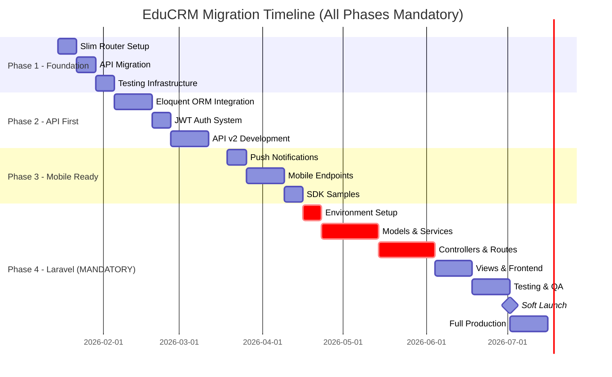

# EduCRM Architecture Migration Plan

> **Version**: 2.0  
> **Date**: January 11, 2026  
> **Status**: Approved  
> **Author**: Architecture Team  
> **Classification**: Internal - Technical

---

## Executive Summary

This document outlines a **comprehensive, mandatory migration strategy** to transform EduCRM from its current Service-Oriented PHP architecture to a **Laravel-based, API-first platform** capable of supporting web, iOS, and Android applications.

### Strategic Goals

| Goal | Description | Priority |
|------|-------------|----------|
| **Scalability** | Support 10,000+ concurrent users | 🔴 Critical |
| **Mobile First** | Native iOS/Android apps with offline sync | 🔴 Critical |
| **Maintainability** | Reduce technical debt by 60% | 🟡 High |
| **Developer Experience** | Faster onboarding, industry-standard patterns | 🟡 High |
| **Security** | Enterprise-grade auth, OWASP compliance | 🔴 Critical |

### Migration Approach

The migration follows a **4-phase mandatory approach**:

1. **Phase 1** — Foundation Strengthening (Routing, Testing)
2. **Phase 2** — API-First Architecture (ORM, JWT Auth)
3. **Phase 3** — Mobile Readiness (Push Notifications, SDKs)
4. **Phase 4** — **Laravel Framework Migration (MANDATORY)**

> [!IMPORTANT]
> Phase 4 (Laravel Migration) is **MANDATORY** and represents the strategic future of EduCRM. All preceding phases prepare the codebase for seamless Laravel adoption.

---

## Table of Contents

1. [Current State Assessment](#1-current-state-assessment)
2. [Target Architecture](#2-target-architecture)
3. [Weakness Remediation](#3-weakness-remediation)
4. [Phase 1: Foundation Strengthening](#4-phase-1-foundation-strengthening)
5. [Phase 2: API-First Architecture](#5-phase-2-api-first-architecture)
6. [Phase 3: Mobile Readiness](#6-phase-3-mobile-readiness)
7. [Phase 4: Laravel Framework Migration](#7-phase-4-laravel-framework-migration)
8. [Implementation Timeline](#8-implementation-timeline)
9. [Risk Assessment](#9-risk-assessment)
10. [Testing Strategy](#10-testing-strategy)
11. [Database Migration Strategy](#11-database-migration-strategy)
12. [Security Hardening](#12-security-hardening)
13. [Performance Optimization](#13-performance-optimization)
14. [Deployment Strategy](#14-deployment-strategy)
15. [Training & Documentation](#15-training--documentation)

---

## 1. Current State Assessment

### 1.1 Architecture Classification

| Aspect | Current Implementation |
|--------|------------------------|
| **Pattern** | Service-Oriented Modular PHP |
| **Autoloading** | PSR-4 via Composer (`EduCRM\` namespace) |
| **DI Container** | Custom `ServiceContainer` (singleton) |
| **View Layer** | PHP templates + TailwindCSS + Alpine.js |
| **API Layer** | Basic REST in `api/v1/` |
| **Database** | Raw PDO queries |
| **Authentication** | Session-based + JWT middleware |

### 1.2 Strengths

- ✅ **PSR-4 Autoloading** — Clean namespace organization under `EduCRM\`
- ✅ **Service Layer** — 28+ dedicated services (DashboardService, TaskService, etc.)
- ✅ **Dependency Injection** — Custom ServiceContainer with singleton support
- ✅ **Modern Frontend** — Alpine.js for reactivity without build complexity
- ✅ **Environment Config** — `.env` based configuration
- ✅ **Modular Structure** — Clear module separation (`modules/students`, `modules/tasks`, etc.)

### 1.3 Weaknesses

| Issue | Impact | Priority |
|-------|--------|----------|
| No centralized routing | Direct file access, URL exposure | 🔴 High |
| No ORM | Manual SQL, inconsistent queries | 🟡 Medium |
| Mixed concerns in modules | Business logic in view files | 🟡 Medium |
| Limited test coverage | Risk during refactoring | 🟡 Medium |
| No API versioning strategy | Breaking changes to mobile apps | 🔴 High |
| Session-only auth | Cannot support mobile apps | 🔴 High |

---

## 2. Target Architecture

### 2.1 High-Level Architecture Diagram

```
┌─────────────────────────────────────────────────────────────────┐
│                        CLIENT LAYER                             │
├─────────────────┬─────────────────────┬─────────────────────────┤
│   Web (Browser) │   iOS App (Swift)   │   Android (Kotlin)      │
│   Alpine.js +   │   SwiftUI / UIKit   │   Jetpack Compose       │
│   TailwindCSS   │                     │                         │
└────────┬────────┴──────────┬──────────┴───────────┬─────────────┘
         │                   │                      │
         │              HTTPS/TLS                   │
         ▼                   ▼                      ▼
┌─────────────────────────────────────────────────────────────────┐
│                     API GATEWAY LAYER                           │
│                                                                 │
│   ┌─────────────┐  ┌─────────────┐  ┌─────────────────────┐    │
│   │ /api/v1/*   │  │ /api/v2/*   │  │ Rate Limiting       │    │
│   │ Legacy API  │  │ Mobile API  │  │ CORS Headers        │    │
│   └─────────────┘  └─────────────┘  └─────────────────────┘    │
│                                                                 │
│   Authentication: JWT (Stateless) + OAuth2 (Social Login)       │
└───────────────────────────┬─────────────────────────────────────┘
                            │
                            ▼
┌─────────────────────────────────────────────────────────────────┐
│                      CONTROLLER LAYER                           │
│                                                                 │
│   ┌────────────┐ ┌──────────────┐ ┌──────────────────────┐     │
│   │ WebRoutes  │ │ ApiRoutes    │ │ Middleware Pipeline  │     │
│   │ (Slim/Lrvl)│ │ (REST/JSON)  │ │ Auth → CORS → Rate   │     │
│   └────────────┘ └──────────────┘ └──────────────────────┘     │
└───────────────────────────┬─────────────────────────────────────┘
                            │
                            ▼
┌─────────────────────────────────────────────────────────────────┐
│                       SERVICE LAYER                             │
│                  (Existing EduCRM Services)                     │
│                                                                 │
│   DashboardService │ StudentService │ TaskService │ EmailSvc    │
│   InvoiceService   │ DocumentService│ BranchService│ etc.       │
└───────────────────────────┬─────────────────────────────────────┘
                            │
                            ▼
┌─────────────────────────────────────────────────────────────────┐
│                     REPOSITORY LAYER                            │
│              (NEW: Abstract data access)                        │
│                                                                 │
│   StudentRepository │ TaskRepository │ InvoiceRepository        │
│   └─── Eloquent ORM (Standalone) / Doctrine DBAL ───┘           │
└───────────────────────────┬─────────────────────────────────────┘
                            │
                            ▼
┌─────────────────────────────────────────────────────────────────┐
│                      DATABASE LAYER                             │
│                                                                 │
│   ┌──────────────────────────────────────────────────────┐     │
│   │                     MySQL / MariaDB                  │     │
│   │   (Existing Schema + Migrations for Version Control) │     │
│   └──────────────────────────────────────────────────────┘     │
└─────────────────────────────────────────────────────────────────┘
```

### 2.2 Key Architectural Principles

1. **API-First Design** — Every feature must have an API endpoint before UI
2. **Stateless Authentication** — JWT tokens for all client types
3. **Service Reusability** — Keep existing services, add repository layer below
4. **Versioned APIs** — Support multiple API versions simultaneously
5. **Single Responsibility** — Controllers handle HTTP, Services handle logic

---

## 3. Weakness Remediation

### 3.1 Problem: No Centralized Routing

**Current State:**
```
modules/students/list.php      → Direct file access
modules/students/add.php       → No URL abstraction
```

**Solution: Implement Slim Router**

```php
// public/index.php (New Front Controller)
<?php
require __DIR__ . '/../app/bootstrap.php';

use Slim\Factory\AppFactory;
use EduCRM\Middleware\AuthMiddleware;

$app = AppFactory::create();

// Web Routes (Render templates)
$app->get('/', [HomeController::class, 'dashboard']);
$app->get('/students', [StudentController::class, 'index']);
$app->get('/students/{id}', [StudentController::class, 'show']);

// API Routes (JSON responses)
$app->group('/api/v1', function ($group) {
    $group->get('/students', [ApiStudentController::class, 'list']);
    $group->post('/students', [ApiStudentController::class, 'create']);
})->add(new AuthMiddleware());

$app->run();
```

**Required Files:**
| File | Purpose |
|------|---------|
| `public/index.php` | Front controller |
| `app/Routes/web.php` | Web route definitions |
| `app/Routes/api.php` | API route definitions |
| `app/Controllers/` | New controller directory |

---

### 3.2 Problem: No ORM

**Current State:**
```php
// Manual SQL scattered across services
$stmt = $pdo->prepare("SELECT * FROM students WHERE id = ?");
$stmt->execute([$id]);
```

**Solution: Adopt Standalone Eloquent ORM**

```bash
composer require illuminate/database illuminate/events
```

```php
// app/Models/Student.php
namespace EduCRM\Models;

use Illuminate\Database\Eloquent\Model;

class Student extends Model
{
    protected $table = 'users';
    protected $fillable = ['name', 'email', 'phone'];
    
    public function enrollments()
    {
        return $this->hasMany(Enrollment::class);
    }
    
    public function scopeStudents($query)
    {
        return $query->whereHas('roles', fn($q) => $q->where('name', 'student'));
    }
}
```

```php
// Usage in Services (refactored)
$students = Student::students()->with('enrollments')->get();
```

---

### 3.3 Problem: Mixed Concerns in Modules

**Current State:**
```php
// modules/students/list.php
<?php
require_once '../../app/bootstrap.php';
// Business logic HERE
$students = $pdo->query("SELECT * FROM users...");
// Presentation HERE
?>
<html>...</html>
```

**Solution: MVC Separation**

```
app/
├── Controllers/
│   ├── Web/
│   │   └── StudentController.php      # Handles web requests
│   └── Api/
│       └── StudentController.php      # Handles API requests
├── Services/
│   └── StudentService.php             # Business logic (existing)
├── Models/
│   └── Student.php                    # Eloquent model
└── Views/
    └── students/
        ├── index.blade.php            # List view
        └── profile.blade.php          # Detail view
```

**Controller Example:**
```php
// app/Controllers/Web/StudentController.php
namespace EduCRM\Controllers\Web;

class StudentController
{
    private StudentService $studentService;
    
    public function __construct(StudentService $service)
    {
        $this->studentService = $service;
    }
    
    public function index(Request $request, Response $response): Response
    {
        $students = $this->studentService->getAllStudents();
        return $this->view('students/index', ['students' => $students]);
    }
}
```

---

### 3.4 Problem: Session-Only Authentication

**Current State:**
```php
// Session-based (web only)
$_SESSION['user_id'] = $user['id'];
```

**Solution: Dual Authentication System**

```php
// app/Services/AuthService.php
namespace EduCRM\Services;

use Firebase\JWT\JWT;

class AuthService
{
    private string $secretKey;
    
    public function __construct()
    {
        $this->secretKey = $_ENV['JWT_SECRET'];
    }
    
    // For mobile apps
    public function generateToken(array $user): string
    {
        $payload = [
            'iss' => 'educrm',
            'sub' => $user['id'],
            'iat' => time(),
            'exp' => time() + (60 * 60 * 24), // 24 hours
            'roles' => $user['roles']
        ];
        return JWT::encode($payload, $this->secretKey, 'HS256');
    }
    
    // Validate token from mobile request
    public function validateToken(string $token): ?array
    {
        try {
            $decoded = JWT::decode($token, new Key($this->secretKey, 'HS256'));
            return (array) $decoded;
        } catch (\Exception $e) {
            return null;
        }
    }
}
```

**API Login Endpoint:**
```php
// api/v1/auth/login.php → Router: POST /api/v1/auth/login
public function login(Request $request): Response
{
    $credentials = $request->getParsedBody();
    $user = $this->authService->authenticate($credentials);
    
    if (!$user) {
        return $this->json(['error' => 'Invalid credentials'], 401);
    }
    
    return $this->json([
        'token' => $this->authService->generateToken($user),
        'user' => [
            'id' => $user['id'],
            'name' => $user['name'],
            'roles' => $user['roles']
        ]
    ]);
}
```

---

## 4. Phase 1: Foundation Strengthening

**Duration:** 2-3 Weeks  
**Risk Level:** Low  
**Disruption:** Minimal

### 4.1 Tasks

| Task | Description | Est. Hours |
|------|-------------|------------|
| 1.1 | Install Slim Framework via Composer | 2 |
| 1.2 | Create `public/index.php` front controller | 4 |
| 1.3 | Migrate existing APIs to Slim routes | 8 |
| 1.4 | Add `.htaccess` for URL rewriting | 1 |
| 1.5 | Create base Controller class | 4 |
| 1.6 | Install PHPUnit, create test structure | 4 |
| 1.7 | Write tests for existing services | 8 |

### 4.2 Composer Dependencies

```json
{
    "require": {
        "slim/slim": "^4.0",
        "slim/psr7": "^1.6",
        "php-di/php-di": "^7.0"
    },
    "require-dev": {
        "phpunit/phpunit": "^9.6"
    }
}
```

### 4.3 Apache Rewrite Rules

```apache
# public/.htaccess
RewriteEngine On
RewriteCond %{REQUEST_FILENAME} !-f
RewriteCond %{REQUEST_FILENAME} !-d
RewriteRule ^ index.php [QSA,L]
```

### 4.4 Deliverables

- [ ] Working Slim router with existing functionality preserved
- [ ] All API endpoints migrated to router
- [ ] Base Controller with JSON/HTML response methods
- [ ] PHPUnit configured with initial test suite
- [ ] 80%+ test coverage for critical services

---

## 5. Phase 2: API-First Architecture

**Duration:** 4-6 Weeks  
**Risk Level:** Medium  
**Disruption:** Moderate (backend only)

### 5.1 Tasks

| Task | Description | Est. Hours |
|------|-------------|------------|
| 2.1 | Install Eloquent ORM standalone | 4 |
| 2.2 | Create Eloquent models for all tables | 16 |
| 2.3 | Migrate services to use Eloquent | 24 |
| 2.4 | Implement JWT authentication | 8 |
| 2.5 | Create API v2 endpoints | 16 |
| 2.6 | Add API rate limiting | 4 |
| 2.7 | Create API documentation (OpenAPI/Swagger) | 8 |

### 5.2 API Response Standards

```php
// Successful response
{
    "success": true,
    "data": { ... },
    "meta": {
        "page": 1,
        "per_page": 20,
        "total": 150
    }
}

// Error response
{
    "success": false,
    "error": {
        "code": "VALIDATION_ERROR",
        "message": "Email is required",
        "details": { "field": "email" }
    }
}
```

### 5.3 API Versioning Strategy

```
/api/v1/*  → Legacy API (maintain for existing integrations)
/api/v2/*  → Mobile-optimized API (new development)
```

**Version Migration Rules:**
| v1 (Legacy) | v2 (Mobile) |
|-------------|-------------|
| Session + JWT auth | JWT only |
| Mixed response formats | Standardized JSON |
| No pagination metadata | Always includes pagination |
| Inline relationships | Separate endpoint or `?include=` |

### 5.4 Deliverables

- [ ] Eloquent models for all 25+ tables
- [ ] Services refactored to repository pattern
- [ ] JWT auth with token refresh endpoint
- [ ] API v2 with full CRUD for core entities
- [ ] Swagger/OpenAPI documentation
- [ ] Rate limiting (100 req/min per user)

---

## 6. Phase 3: Mobile Readiness

**Duration:** 3-4 Weeks  
**Risk Level:** Low (additive changes)  
**Disruption:** None to web app

### 6.1 Tasks

| Task | Description | Est. Hours |
|------|-------------|------------|
| 3.1 | Push notification service (Firebase) | 8 |
| 3.2 | Offline-sync strategy documentation | 4 |
| 3.3 | Media upload optimization (S3/local) | 8 |
| 3.4 | Deep linking support | 4 |
| 3.5 | Create mobile-specific endpoints | 12 |
| 3.6 | Build iOS SDK sample | 16 |
| 3.7 | Build Android SDK sample | 16 |

### 6.2 Mobile-Specific Endpoints

```
POST   /api/v2/auth/register        # Mobile registration
POST   /api/v2/auth/login           # Returns JWT
POST   /api/v2/auth/refresh         # Token refresh
POST   /api/v2/auth/logout          # Invalidate token
POST   /api/v2/devices              # Register push notification device

GET    /api/v2/me                   # Current user profile
GET    /api/v2/me/tasks             # My tasks (paginated)
GET    /api/v2/me/notifications     # My notifications

# Student-specific
GET    /api/v2/classes              # Available classes
GET    /api/v2/classes/{id}/tasks   # Tasks for a class
POST   /api/v2/tasks/{id}/submit    # Submit task attachment
```

### 6.3 Push Notification Integration

```php
// app/Services/PushNotificationService.php
namespace EduCRM\Services;

class PushNotificationService
{
    public function sendToDevice(string $deviceToken, string $title, string $body): bool
    {
        // Firebase Cloud Messaging
        $message = [
            'to' => $deviceToken,
            'notification' => [
                'title' => $title,
                'body' => $body,
                'sound' => 'default'
            ],
            'data' => [
                'click_action' => 'OPEN_ACTIVITY'
            ]
        ];
        
        // Send via FCM HTTP API
        return $this->sendFCM($message);
    }
}
```

### 6.4 Deliverables

- [ ] Firebase integration for push notifications
- [ ] Device token registration endpoint
- [ ] Mobile-optimized API endpoints
- [ ] Image resizing for mobile bandwidth
- [ ] Sample iOS Swift project
- [ ] Sample Android Kotlin project

---

## 7. Phase 4: Laravel Framework Migration

**Duration:** 10-14 Weeks  
**Risk Level:** Medium (with proper preparation)  
**Disruption:** Managed — parallel development environment  
**Status:** **MANDATORY**

> [!IMPORTANT]
> This phase is **MANDATORY** and represents the strategic future of EduCRM. Laravel provides:
> - Industry-standard patterns for team scalability
> - Enterprise-grade features out-of-the-box
> - Long-term maintainability and community support
> - Seamless mobile API development with Sanctum

---

### 7.1 Why Laravel is Mandatory

| Current Challenge | Laravel Solution |
|-------------------|------------------|
| Manual cron jobs in `/cron/` | Built-in Task Scheduler with monitoring |
| Custom ServiceContainer | Powerful IoC Container with auto-injection |
| Raw PDO queries | Eloquent ORM with query optimization |
| Custom email sending | Laravel Mail with queue support |
| No background jobs | Laravel Queues (Redis, Database, SQS) |
| Session-only auth | Sanctum (SPA + Mobile + API tokens) |
| Manual file uploads | Laravel Storage (S3, local, cloud) |
| No admin panel | Filament/Nova for instant admin UI |

---

### 7.2 Laravel Version & Requirements

| Component | Version | Purpose |
|-----------|---------|----------|
| **Laravel** | 11.x LTS | Core framework |
| **PHP** | 8.2+ | Required by Laravel 11 |
| **MySQL** | 8.0+ | Database (existing) |
| **Redis** | 7.0+ | Caching, queues, sessions |
| **Composer** | 2.x | Dependency management |
| **Node.js** | 20.x LTS | Asset compilation (Vite) |

---

### 7.3 File Mapping Strategy

```
CURRENT STRUCTURE                    LARAVEL TARGET
━━━━━━━━━━━━━━━━━━━━━━━━━━━━━━━━━━━━━━━━━━━━━━━━━━━━━━━━━━━━━━

app/
├── Services/                    →   app/Services/           ✅ KEEP AS-IS
│   ├── DashboardService.php         (Inject via constructor)
│   ├── StudentService.php    
│   └── TaskService.php        
├── Helpers/                     →   app/Helpers/            ✅ KEEP AS-IS
│   └── Env.php                      (Or use config())
├── Contracts/                   →   app/Contracts/          ✅ KEEP AS-IS
└── bootstrap.php                →   bootstrap/app.php       🔄 REPLACE

modules/
├── students/
│   ├── list.php                 →   app/Http/Controllers/StudentController@index
│   ├── add.php                  →   app/Http/Controllers/StudentController@create
│   ├── edit.php                 →   app/Http/Controllers/StudentController@edit
│   └── profile.php              →   app/Http/Controllers/StudentController@show
├── tasks/                       →   app/Http/Controllers/TaskController
├── inquiries/                   →   app/Http/Controllers/InquiryController
└── ... (18 modules)             →   app/Http/Controllers/ (18 controllers)

templates/
├── header.php                   →   resources/views/layouts/app.blade.php
├── footer.php                   →   (merged into layout)
└── sidebar.php                  →   resources/views/components/sidebar.blade.php

config/
└── config.php                   →   config/database.php + config/app.php

public/
├── assets/css/                  →   resources/css/ (compiled by Vite)
├── assets/js/                   →   resources/js/ (compiled by Vite)
└── uploads/                     →   storage/app/public/uploads (symlinked)

api/
└── v1/                          →   routes/api.php (versioned groups)

cron/
├── daily_tasks.php              →   app/Console/Commands/ + Kernel scheduler
└── cleanup.php                  →   app/Console/Commands/CleanupCommand.php
```

---

### 7.4 Migration Steps (Detailed)

#### Step 1: Environment Setup (Week 1)

```bash
# Create new Laravel project in parallel directory
composer create-project laravel/laravel educrm-v2

# Install required packages
cd educrm-v2
composer require laravel/sanctum
composer require filament/filament
composer require spatie/laravel-permission
composer require laravel/horizon

# Install frontend dependencies
npm install
npm install alpinejs @tailwindcss/forms
```

#### Step 2: Database Connection (Week 1)

```php
// config/database.php - Connect to existing database
'mysql' => [
    'driver' => 'mysql',
    'host' => env('DB_HOST', 'localhost'),
    'database' => env('DB_DATABASE', 'edu_crm'), // EXISTING DB
    'username' => env('DB_USERNAME', 'root'),
    'password' => env('DB_PASSWORD', ''),
    'charset' => 'utf8mb4',
    'collation' => 'utf8mb4_unicode_ci',
],
```

#### Step 3: Create Eloquent Models (Week 2-3)

```php
// app/Models/User.php
namespace App\Models;

use Illuminate\Foundation\Auth\User as Authenticatable;
use Laravel\Sanctum\HasApiTokens;
use Spatie\Permission\Traits\HasRoles;

class User extends Authenticatable
{
    use HasApiTokens, HasRoles;

    protected $fillable = [
        'name', 'email', 'password', 'phone',
        'country_id', 'education_level_id', 'branch_id'
    ];

    protected $hidden = ['password', 'remember_token'];

    // Relationships from existing schema
    public function enrollments()
    {
        return $this->hasMany(Enrollment::class, 'student_id');
    }

    public function tasks()
    {
        return $this->hasMany(Task::class, 'assigned_to');
    }

    public function branch()
    {
        return $this->belongsTo(Branch::class);
    }

    // Scope for students only
    public function scopeStudents($query)
    {
        return $query->role('student');
    }
}
```

```php
// app/Models/Student.php (Proxy model for clarity)
namespace App\Models;

class Student extends User
{
    protected static function booted()
    {
        static::addGlobalScope('students', function ($query) {
            $query->role('student');
        });
    }

    public function documents()
    {
        return $this->hasMany(Document::class, 'user_id');
    }

    public function visaApplications()
    {
        return $this->hasMany(VisaApplication::class);
    }
}
```

#### Step 4: Migrate Services (Week 3-4)

```php
// app/Services/DashboardService.php (Refactored for Laravel)
namespace App\Services;

use App\Models\User;
use App\Models\Task;
use App\Models\Inquiry;
use Illuminate\Support\Facades\Cache;

class DashboardService
{
    public function getStats(): array
    {
        return Cache::remember('dashboard.stats', 300, function () {
            return [
                'total_students' => User::students()->count(),
                'pending_tasks' => Task::pending()->count(),
                'hot_leads' => Inquiry::where('priority', 'hot')->count(),
                'active_visa' => VisaApplication::active()->count(),
            ];
        });
    }

    public function getRecentTasks(int $limit = 5)
    {
        return Task::with('assignee')
            ->pending()
            ->orderBy('due_date')
            ->limit($limit)
            ->get();
    }
}
```

#### Step 5: Create Controllers (Week 4-6)

```php
// app/Http/Controllers/StudentController.php
namespace App\Http\Controllers;

use App\Models\Student;
use App\Services\StudentService;
use Illuminate\Http\Request;

class StudentController extends Controller
{
    public function __construct(
        private StudentService $studentService
    ) {}

    public function index()
    {
        $students = Student::with(['enrollments', 'branch'])
            ->when(auth()->user()->hasRole('teacher'), function ($q) {
                $q->whereHas('enrollments.class', function ($q) {
                    $q->where('teacher_id', auth()->id());
                });
            })
            ->paginate(25);

        return view('students.index', compact('students'));
    }

    public function show(Student $student)
    {
        $student->load(['enrollments.class', 'documents', 'tasks']);
        return view('students.profile', compact('student'));
    }

    public function store(Request $request)
    {
        $validated = $request->validate([
            'name' => 'required|string|max:255',
            'email' => 'required|email|unique:users',
            'phone' => 'nullable|string|max:20',
        ]);

        $student = $this->studentService->create($validated);

        return redirect()
            ->route('students.show', $student)
            ->with('success', 'Student created successfully!');
    }
}
```

#### Step 6: Convert Templates to Blade (Week 5-7)

```blade
{{-- resources/views/layouts/app.blade.php --}}
<!DOCTYPE html>
<html lang="en">
<head>
    <meta charset="UTF-8">
    <meta name="viewport" content="width=device-width, initial-scale=1.0">
    <title>{{ $title ?? 'EduCRM' }}</title>
    @vite(['resources/css/app.css', 'resources/js/app.js'])
</head>
<body class="bg-slate-50">
    <x-sidebar />
    
    <main class="ml-64 p-6">
        @if(session('success'))
            <x-alert type="success" :message="session('success')" />
        @endif
        
        {{ $slot }}
    </main>
</body>
</html>
```

```blade
{{-- resources/views/students/index.blade.php --}}
<x-app-layout>
    <x-slot:title>Student Management</x-slot>

    <div class="page-header">
        <h1 class="page-title">Student Records</h1>
        <a href="{{ route('students.create') }}" class="btn btn-primary">
            <x-icon name="plus" /> Add New Student
        </a>
    </div>

    <div class="card">
        <table class="min-w-full">
            <thead>
                <tr>
                    <th>Student</th>
                    <th>Contact</th>
                    <th>Actions</th>
                </tr>
            </thead>
            <tbody>
                @foreach($students as $student)
                    <tr>
                        <td>{{ $student->name }}</td>
                        <td>{{ $student->email }}</td>
                        <td>
                            <a href="{{ route('students.show', $student) }}">
                                <x-icon name="eye" />
                            </a>
                        </td>
                    </tr>
                @endforeach
            </tbody>
        </table>

        {{ $students->links() }}
    </div>
</x-app-layout>
```

#### Step 7: API Routes with Sanctum (Week 6-8)

```php
// routes/api.php
use App\Http\Controllers\Api\V2;

Route::prefix('v2')->group(function () {
    // Public routes
    Route::post('auth/login', [V2\AuthController::class, 'login']);
    Route::post('auth/register', [V2\AuthController::class, 'register']);

    // Protected routes
    Route::middleware('auth:sanctum')->group(function () {
        // User
        Route::get('me', [V2\UserController::class, 'me']);
        Route::post('auth/logout', [V2\AuthController::class, 'logout']);

        // Students
        Route::apiResource('students', V2\StudentController::class);

        // Tasks
        Route::apiResource('tasks', V2\TaskController::class);
        Route::post('tasks/{task}/complete', [V2\TaskController::class, 'complete']);

        // Classes
        Route::apiResource('classes', V2\ClassController::class);

        // Push Notifications
        Route::post('devices', [V2\DeviceController::class, 'register']);
    });
});

// Keep v1 for backward compatibility
Route::prefix('v1')->group(function () {
    // Legacy endpoints...
});
```

#### Step 8: Queue & Scheduled Jobs (Week 8-9)

```php
// app/Console/Kernel.php
protected function schedule(Schedule $schedule)
{
    // Daily task reminders (replaces cron/daily_tasks.php)
    $schedule->job(new SendTaskReminders)->dailyAt('08:00');

    // Cleanup old logs (replaces cron/cleanup.php)
    $schedule->job(new CleanupOldLogs)->weekly();

    // Generate daily reports
    $schedule->job(new GenerateDailyReport)->dailyAt('23:00');

    // Sync with external services
    $schedule->command('sync:universities')->hourly();
}
```

```php
// app/Jobs/SendTaskReminders.php
namespace App\Jobs;

use App\Models\Task;
use App\Notifications\TaskDueReminder;
use Illuminate\Bus\Queueable;
use Illuminate\Contracts\Queue\ShouldQueue;

class SendTaskReminders implements ShouldQueue
{
    use Queueable;

    public function handle()
    {
        Task::with('assignee')
            ->dueWithin(hours: 24)
            ->pending()
            ->chunk(100, function ($tasks) {
                foreach ($tasks as $task) {
                    $task->assignee->notify(new TaskDueReminder($task));
                }
            });
    }
}
```

#### Step 9: Admin Panel with Filament (Week 9-10)

```php
// app/Filament/Resources/StudentResource.php
namespace App\Filament\Resources;

use App\Models\Student;
use Filament\Forms;
use Filament\Resources\Resource;
use Filament\Tables;

class StudentResource extends Resource
{
    protected static ?string $model = Student::class;
    protected static ?string $navigationIcon = 'heroicon-o-users';

    public static function form(Forms\Form $form): Forms\Form
    {
        return $form->schema([
            Forms\Components\TextInput::make('name')->required(),
            Forms\Components\TextInput::make('email')->email()->required(),
            Forms\Components\TextInput::make('phone'),
            Forms\Components\Select::make('branch_id')
                ->relationship('branch', 'name'),
        ]);
    }

    public static function table(Tables\Table $table): Tables\Table
    {
        return $table->columns([
            Tables\Columns\TextColumn::make('name')->searchable(),
            Tables\Columns\TextColumn::make('email'),
            Tables\Columns\TextColumn::make('branch.name'),
            Tables\Columns\TextColumn::make('created_at')->date(),
        ]);
    }
}
```

#### Step 10: Testing & Deployment (Week 10-14)

```php
// tests/Feature/StudentTest.php
namespace Tests\Feature;

use App\Models\Student;
use App\Models\User;
use Illuminate\Foundation\Testing\RefreshDatabase;
use Tests\TestCase;

class StudentTest extends TestCase
{
    use RefreshDatabase;

    public function test_admin_can_view_students()
    {
        $admin = User::factory()->admin()->create();

        $response = $this->actingAs($admin)->get('/students');

        $response->assertStatus(200);
        $response->assertViewIs('students.index');
    }

    public function test_api_returns_students()
    {
        $user = User::factory()->create();
        Student::factory()->count(5)->create();

        $response = $this->actingAs($user, 'sanctum')
            ->getJson('/api/v2/students');

        $response->assertStatus(200)
            ->assertJsonCount(5, 'data');
    }
}
```

---

### 7.5 Laravel Package Stack

| Package | Purpose | Priority |
|---------|---------|----------|
| `laravel/sanctum` | API token authentication | 🔴 Required |
| `spatie/laravel-permission` | Role-based access control | 🔴 Required |
| `filament/filament` | Admin panel | 🟡 Recommended |
| `laravel/horizon` | Queue monitoring | 🟡 Recommended |
| `spatie/laravel-activitylog` | Audit logging | 🟡 Recommended |
| `laravel/telescope` | Debug assistant | 🟢 Development |
| `barryvdh/laravel-debugbar` | Debug toolbar | 🟢 Development |

---

### 7.6 Parallel Development Strategy

```
┌─────────────────────────────────────────────────────────────┐
│                    WEEK 1-6                                 │
│  ┌─────────────────┐    ┌─────────────────┐                │
│  │  CURRENT SYSTEM │    │  LARAVEL v2     │                │
│  │  (Production)   │    │  (Development)  │                │
│  │                 │    │                 │                │
│  │  /CRM/          │    │  /educrm-v2/    │                │
│  │  Active Users   │    │  Dev Team Only  │                │
│  └─────────────────┘    └─────────────────┘                │
│           │                      │                          │
│           ▼                      ▼                          │
│    ┌──────────────────────────────────────┐                │
│    │         SHARED DATABASE              │                │
│    │           edu_crm                    │                │
│    └──────────────────────────────────────┘                │
└─────────────────────────────────────────────────────────────┘

┌─────────────────────────────────────────────────────────────┐
│                    WEEK 7-10 (Soft Launch)                  │
│  ┌─────────────────┐    ┌─────────────────┐                │
│  │  CURRENT SYSTEM │    │  LARAVEL v2     │                │
│  │  (Read-only)    │    │  (Staging)      │                │
│  │                 │    │                 │                │
│  │  Fallback Mode  │    │  Beta Users     │                │
│  └─────────────────┘    └─────────────────┘                │
└─────────────────────────────────────────────────────────────┘

┌─────────────────────────────────────────────────────────────┐
│                    WEEK 11+ (Full Migration)                │
│                                                             │
│               ┌─────────────────┐                          │
│               │  LARAVEL v2     │                          │
│               │  (Production)   │                          │
│               │                 │                          │
│               │  All Users      │                          │
│               └─────────────────┘                          │
│                        │                                    │
│     ┌──────────────────┼──────────────────┐                │
│     ▼                  ▼                  ▼                │
│   Web App         iOS App          Android App             │
└─────────────────────────────────────────────────────────────┘
```

---

## 8. Implementation Timeline



### 8.1 Milestone Summary

| Milestone | Target Date | Success Criteria | Status |
|-----------|-------------|------------------|--------|
| **M1: Foundation Complete** | Feb 5, 2026 | Slim router working, 80% test coverage | 🔲 Pending |
| **M2: API v2 Live** | Mar 19, 2026 | JWT auth, Eloquent ORM, API docs | 🔲 Pending |
| **M3: Mobile Ready** | Apr 16, 2026 | Push notifications, sample iOS/Android apps | 🔲 Pending |
| **M4: Laravel Soft Launch** | Jun 30, 2026 | Beta users on Laravel, parallel with legacy | 🔲 Pending |
| **M5: Full Production** | Jul 15, 2026 | **All users migrated to Laravel** | 🔲 Pending |

---

## 9. Risk Assessment

| Risk | Probability | Impact | Mitigation |
|------|-------------|--------|------------|
| Breaking existing functionality | Medium | High | Comprehensive test suite before changes |
| Team unfamiliar with Slim/Laravel | Medium | Medium | Training sessions, pair programming |
| Mobile API performance issues | Low | High | Load testing, CDN for assets |
| JWT token security | Low | Critical | Short-lived tokens, HTTPS only, rate limiting |
| Database migration errors | Low | High | Test migrations on staging, backups |

---

## 10. Testing Strategy

### 10.1 Test Pyramid

```
         ┌─────────────┐
         │   E2E Tests │  (5%)
         │   (Browser) │
         ├─────────────┤
         │ Integration │  (20%)
         │   (API)     │
         ├─────────────┤
         │    Unit     │  (75%)
         │  (Services) │
         └─────────────┘
```

### 10.2 Test Files Structure

```
tests/
├── Unit/
│   ├── Services/
│   │   ├── StudentServiceTest.php
│   │   ├── TaskServiceTest.php
│   │   └── AuthServiceTest.php
│   └── Models/
│       └── StudentTest.php
├── Integration/
│   ├── Api/
│   │   ├── AuthApiTest.php
│   │   ├── StudentApiTest.php
│   │   └── TaskApiTest.php
│   └── Database/
│       └── MigrationTest.php
└── E2E/
    └── LoginFlowTest.php
```

### 10.3 CI/CD Pipeline (GitHub Actions)

```yaml
# .github/workflows/test.yml
name: Tests
on: [push, pull_request]
jobs:
  test:
    runs-on: ubuntu-latest
    steps:
      - uses: actions/checkout@v3
      - uses: shivammathur/setup-php@v2
        with:
          php-version: '8.1'
      - run: composer install
      - run: vendor/bin/phpunit --coverage-text
```

---

## Appendix A: Quick Reference Commands

```bash
# Install dependencies
composer require slim/slim slim/psr7 php-di/php-di
composer require illuminate/database illuminate/events
composer require firebase/php-jwt

# Run tests
vendor/bin/phpunit

# Generate API docs (with swagger-php)
vendor/bin/openapi app -o public/api-docs.json
```

---

## Appendix B: File Mapping

| Current Location | New Location (Post-Migration) |
|------------------|-------------------------------|
| `modules/students/list.php` | `app/Controllers/Web/StudentController@index` |
| `modules/students/add.php` | `app/Controllers/Web/StudentController@create` |
| `api/v1/students/` | `app/Controllers/Api/v2/StudentController` |
| `templates/header.php` | `resources/views/layouts/app.blade.php` |
| `app/Services/*` | `app/Services/*` (unchanged) |

---

## Appendix C: Team Skills Required

| Skill | Phase 1 | Phase 2 | Phase 3 | Phase 4 |
|-------|---------|---------|---------|---------|
| PHP 8+ | ✅ | ✅ | ✅ | ✅ |
| Slim Framework | ✅ | ✅ | ✅ | — |
| Eloquent ORM | — | ✅ | ✅ | ✅ |
| JWT/OAuth | — | ✅ | ✅ | ✅ |
| Swift (iOS) | — | — | ✅ | — |
| Kotlin (Android) | — | — | ✅ | — |
| Laravel | — | — | — | ✅ |

---

## 11. Database Migration Strategy

### 11.1 Schema Compatibility

The Laravel migration will use the **existing database schema** without modifications during the initial migration. This ensures zero data loss and rollback capability.

| Strategy | Description |
|----------|-------------|
| **Connect to Existing DB** | Laravel connects to `edu_crm` database |
| **No Initial Migrations** | Use `--pretend` to validate without changes |
| **Incremental Schema Changes** | Add new tables/columns via Laravel migrations |
| **Backward Compatibility** | Legacy system remains functional during migration |

### 11.2 Data Migration Commands

```bash
# Generate migrations from existing schema (documentation only)
php artisan schema:dump

# Create migration for new features only
php artisan make:migration add_device_tokens_table

# Run on staging first
php artisan migrate --database=staging

# Production migration
php artisan migrate --force
```

### 11.3 Model Factory Strategy

```php
// database/factories/StudentFactory.php
namespace Database\Factories;

use App\Models\Student;
use Illuminate\Database\Eloquent\Factories\Factory;

class StudentFactory extends Factory
{
    protected $model = Student::class;

    public function definition(): array
    {
        return [
            'name' => $this->faker->name(),
            'email' => $this->faker->unique()->safeEmail(),
            'phone' => $this->faker->phoneNumber(),
            'password' => bcrypt('password'),
            'branch_id' => 1,
        ];
    }
}
```

---

## 12. Security Hardening

### 12.1 Authentication Security

| Feature | Implementation |
|---------|----------------|
| **Password Hashing** | bcrypt (Laravel default, replaces custom) |
| **Token Expiry** | 24h access, 7d refresh tokens |
| **Rate Limiting** | 60 requests/min for API |
| **CORS** | Whitelisted origins only |
| **HTTPS** | Enforced via middleware |

### 12.2 Security Middleware Stack

```php
// app/Http/Kernel.php
protected $middlewareGroups = [
    'api' => [
        \Laravel\Sanctum\Http\Middleware\EnsureFrontendRequestsAreStateful::class,
        'throttle:api',
        \Illuminate\Routing\Middleware\SubstituteBindings::class,
    ],
];

protected $routeMiddleware = [
    'auth' => \App\Http\Middleware\Authenticate::class,
    'role' => \Spatie\Permission\Middlewares\RoleMiddleware::class,
    'permission' => \Spatie\Permission\Middlewares\PermissionMiddleware::class,
];
```

### 12.3 OWASP Top 10 Compliance

| Vulnerability | Laravel Protection |
|---------------|-------------------|
| **Injection** | Eloquent ORM (parameterized queries) |
| **Broken Auth** | Sanctum + bcrypt |
| **XSS** | Blade auto-escaping `{{ }}` |
| **CSRF** | `@csrf` directive |
| **Broken Access** | Policies + Gates |
| **Security Misconfiguration** | `.env` + config caching |
| **Sensitive Data Exposure** | HTTPS + encrypted sessions |

---

## 13. Performance Optimization

### 13.1 Caching Strategy

```php
// config/cache.php - Redis for production
'default' => env('CACHE_DRIVER', 'redis'),

// Usage in services
Cache::tags(['students'])->remember('all_students', 3600, function () {
    return Student::with('branch')->get();
});

// Cache invalidation on update
Student::saved(function () {
    Cache::tags(['students'])->flush();
});
```

### 13.2 Database Optimization

| Technique | Implementation |
|-----------|----------------|
| **Eager Loading** | `Student::with(['enrollments', 'tasks'])` |
| **Query Caching** | Redis-backed query cache |
| **Connection Pooling** | Laravel Octane (optional) |
| **Read Replicas** | For analytics queries |

### 13.3 API Response Optimization

```php
// app/Http/Resources/StudentResource.php
namespace App\Http\Resources;

use Illuminate\Http\Resources\Json\JsonResource;

class StudentResource extends JsonResource
{
    public function toArray($request): array
    {
        return [
            'id' => $this->id,
            'name' => $this->name,
            'email' => $this->email,
            'branch' => new BranchResource($this->whenLoaded('branch')),
            'enrollments_count' => $this->whenCounted('enrollments'),
        ];
    }
}
```

---

## 14. Deployment Strategy

### 14.1 Environment Setup

```
Production Server Requirements:
├── Ubuntu 22.04 LTS
├── PHP 8.2+ (php-fpm)
├── MySQL 8.0+
├── Redis 7.0+
├── Nginx
├── Node.js 20 LTS
└── Supervisor (for queues)
```

### 14.2 Deployment Workflow

```bash
# Deploy script (deploy.sh)
#!/bin/bash
set -e

cd /var/www/educrm-v2

# Pull latest code
git pull origin main

# Install dependencies
composer install --no-dev --optimize-autoloader
npm ci && npm run build

# Cache configuration
php artisan config:cache
php artisan route:cache
php artisan view:cache

# Run migrations
php artisan migrate --force

# Restart services
sudo supervisorctl restart all
sudo systemctl reload nginx
```

### 14.3 Zero-Downtime Deployment

```nginx
# nginx.conf - Blue/Green deployment
upstream educrm {
    server 127.0.0.1:8000 weight=1;  # Blue (current)
    server 127.0.0.1:8001 weight=0;  # Green (new)
}
```

### 14.4 Rollback Procedure

```bash
# Rollback to previous release
cd /var/www/educrm-v2
git checkout <previous-tag>
composer install --no-dev
php artisan migrate:rollback --step=1
php artisan config:cache
sudo supervisorctl restart all
```

---

## 15. Training & Documentation

### 15.1 Developer Training Plan

| Week | Topic | Audience |
|------|-------|----------|
| 1 | Laravel Fundamentals | All developers |
| 2 | Eloquent ORM & Relationships | Backend team |
| 3 | Blade Templates & Components | Frontend team |
| 4 | Sanctum & API Development | API team |
| 5 | Testing with PHPUnit | All developers |
| 6 | Queue & Job Management | Backend team |

### 15.2 Documentation Requirements

| Document | Location | Owner |
|----------|----------|-------|
| API Documentation | `/docs/api/openapi.yaml` | Backend Lead |
| Database ERD | `/docs/database/erd.md` | DBA |
| Deployment Guide | `/docs/deployment/README.md` | DevOps |
| User Guide | `/docs/user/guide.md` | Product Team |
| Architecture Decision Records | `/docs/adr/` | Tech Lead |

### 15.3 Knowledge Transfer Sessions

```markdown
## Session Schedule

1. **Architecture Overview** (2 hours)
   - Laravel folder structure
   - Service Container & DI
   - Request lifecycle

2. **Codebase Walkthrough** (3 hours)
   - Model relationships
   - Controller patterns
   - Middleware pipeline

3. **Testing Workshop** (2 hours)
   - Unit tests
   - Feature tests
   - Database factories

4. **Deployment Training** (1 hour)
   - CI/CD pipeline
   - Environment management
   - Monitoring & logging
```

---

## Document Control

| Version | Date | Author | Changes |
|---------|------|--------|---------|
| 1.0 | 2026-01-11 | Architecture Team | Initial draft |
| 2.0 | 2026-01-11 | Architecture Team | Made Laravel mandatory, added sections 11-15, expanded Phase 4 |

---

> [!IMPORTANT]
> This is a living document. Update as implementation progresses and new requirements emerge.

